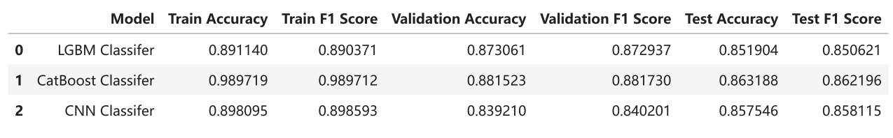
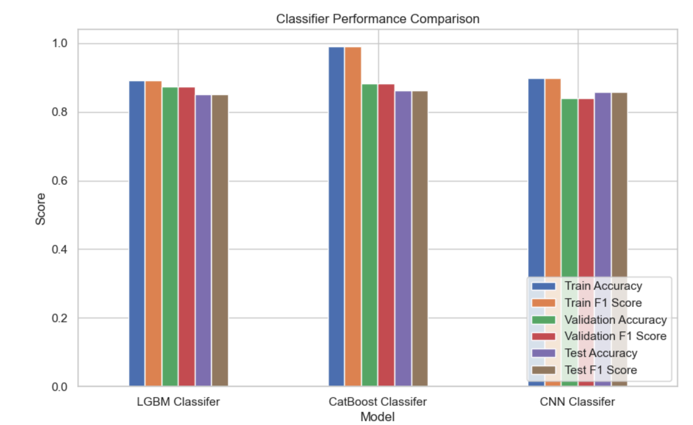

# Exoplanet Classification using Machine Learning  
**Project:** NASA Space Apps Challenge 2025  

---

## Overview
This project builds a complete machine learning pipeline to classify **Kepler Objects of Interest (KOI)** into two categories:  
- **CANDIDATE (1)**  
- **CONFIRMED (0)**  

We trained and compared three models — **LightGBM**, **CatBoost**, and a **CNN** — to identify exoplanet candidates based on astrophysical features such as orbital period, radius, temperature, and stellar parameters.  
The final CatBoost model achieved the **best test accuracy (~86%)** and **PR-AUC ≈ 0.93**.

---

## Setup & Dependencies

Install dependencies with:
```bash
pip install -r requirements.txt
```

**Main Libraries Used**
| Category | Libraries |
|-----------|------------|
| Data Handling | pandas, numpy |
| Machine Learning | scikit-learn, lightgbm, catboost |
| Deep Learning | tensorflow, keras |
| Hyperparameter Optimization | optuna |
| Visualization | matplotlib, seaborn |

---

##  Data

**Source:** [NASA Exoplanet Archive](https://exoplanetarchive.ipac.caltech.edu/)  
Dataset used: `Kepler Objects of Interest (KOI).csv`  

### Key Processing Steps
1. Removed redundant columns (`kepid`, `kepler_name`, `koi_score`, etc.)
2. Filtered only **CANDIDATE** and **CONFIRMED** samples  
3. Created binary target variable:  
   ```
   Candidate → 1
   Confirmed → 0
   ```
4. Filled missing values using mean/mode imputation  
5. Scaled all numeric features using `StandardScaler`  
6. Split dataset into:
   - **Train (70%)**
   - **Validation (15%)**
   - **Test (15%)**

---

##  Data Preprocessing Code

```python
def preprocess_koi_df(koi_df):
    columns_to_remove = ['kepid', 'kepoi_name', 'kepler_name', 'koi_pdisposition',
                         'koi_score', 'koi_teq_err1', 'koi_teq_err2']
    for c in columns_to_remove:
        if c in koi_df.columns:
            koi_df.drop(columns=c, inplace=True)
    koi_df = koi_df[koi_df['koi_disposition'].isin(['CANDIDATE', 'CONFIRMED'])]
    koi_df['y'] = (koi_df['koi_disposition'] == 'CANDIDATE').astype(int)
    for col in koi_df.columns:
        if koi_df[col].dtype in [np.float64, np.int64]:
            koi_df[col].fillna(koi_df[col].mean(), inplace=True)
        else:
            mode = koi_df[col].mode()
            if not mode.empty:
                koi_df[col].fillna(mode[0], inplace=True)
    return koi_df
```

---

## Models

###  1. LightGBM
- Fast and efficient tree-based classifier  
- Tuned using Optuna (40 trials, 5-fold Stratified CV)  
- **Best CV PR-AUC:** 0.9282  

**Best Parameters:**
```python
{
  'learning_rate': 0.0229,
  'num_leaves': 222,
  'max_depth': 5,
  'subsample': 0.773,
  'colsample_bytree': 0.688
}
```

---

###  2. CatBoost
- Ordered boosting for categorical features  
- Tuned via Optuna (40 trials)  
- **Best CV PR-AUC:** 0.9311  

**Best Parameters:**
```python
{
  'iterations': 287,
  'learning_rate': 0.2626,
  'depth': 4,
  'l2_leaf_reg': 9.858,
  'random_strength': 0.706
}
```

---

###  3. CNN
- Implemented with TensorFlow / Keras  
- Architecture:
```python
model = keras.Sequential([
    layers.Dense(128, activation='relu', input_shape=(X_train.shape[1],)),
    layers.Dropout(0.3),
    layers.Dense(64, activation='relu'),
    layers.Dense(1, activation='sigmoid')
])
```
- Early stopping used to prevent overfitting  
- **Validation PR-AUC:** 0.9099

---

##  Evaluation Metrics


